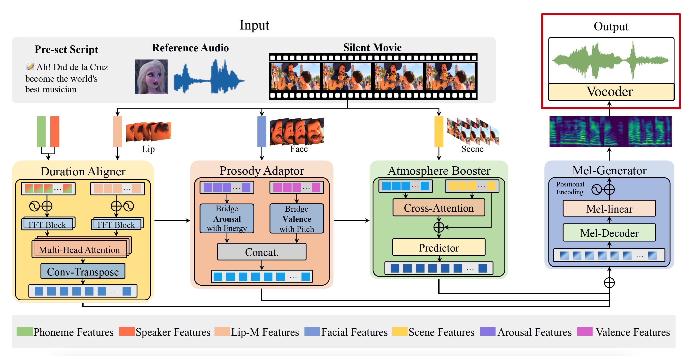

# HPMDubbing_Vocoder
This repository is the vocoder of [our model (HPMDubbing)](https://github.com/GalaxyCong/HPMDubbing), which is used to convert the mel-spectrogram generated by our model into time-domain waveform. 


## Pretrained Models
We provide the pretrained models. 
One can download the checkpoints of generator (e.g., g_05000000) within the listed folders.


|Folder Name|Sampling Rate|Hop Length|Filter Length|Win Length|Params.|Dataset|Fine-Tuned|
|------|---|---|---|---|---|------|---|
|[HPM_Chem](https://drive.google.com/file/d/1MIIAHpePjB4tndkERW1rx0AVKiAKMo2K/view?usp=sharing)|16000 Hz|160|1024|640|55M|LibriTTS|No|
|[HPM_V2C]()|22050 Hz|220|1024|880|56M|LibriTTS|No|


## Training
1. Please run
    ```
    python train_V2C_HiFiGAN.py --config config_V2C_22050Hz.json
    ```
    or
    ```
    python train_hifigan_16KHz.py --config config_Chem_16KHz.json
    ```
    
## Inference
1. inference.py : wav -> mel -> wav
    ```
    python inference.py --checkpoint_file [Your path of checkpoint_file]
    ```
2. inference_e2e.py :  mel -> wav
    ```
    python inference_e2e.py --checkpoint_file [Your path of checkpoint_file]
    ```
    

## tensorboard
1. Please run
    ```
    tensorboard --logdir HifiGAN_16/logs/ --port=[Your port]
    ```
    or 
    ```
    tensorboard --logdir My_vocoder_V2C/logs/ --port=[Your port]
    ```

# References
- [HiFi-GAN: Generative Adversarial Networks for Efficient and High Fidelity Speech Synthesis](https://arxiv.org/pdf/2010.05646.pdf), J. Kong, *et al*. 


# Citation
